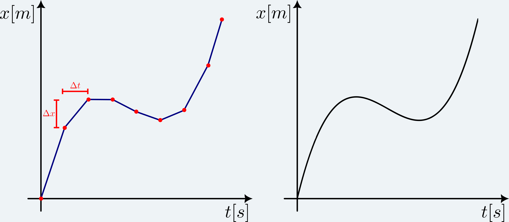
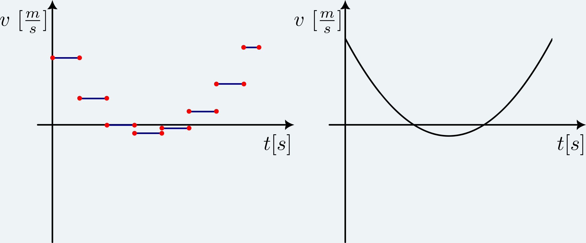
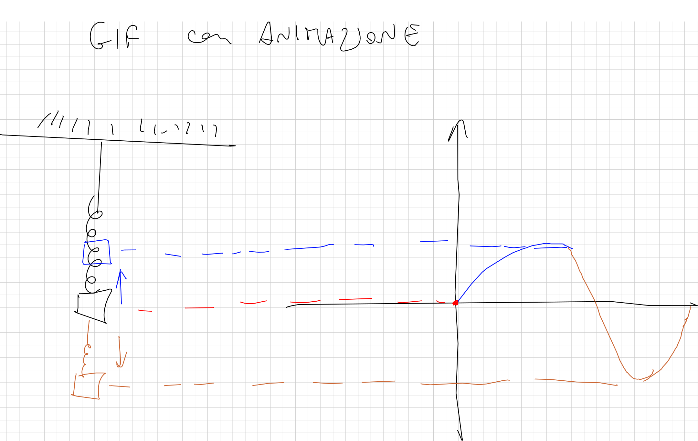

# Moto rettilineo

Il moto rettilineo è il modello più <strong>basilare</strong>, ma comunque molto rilevante, perché le sue applicazioni coinvolgono tutti quei sistemi che, pur essendo nello spazio tridimensionale, possono essere <em>appiattiti</em> su una dimensione. L'esempio più banale potrebbe essere un auto in corsa su un'autostrada senza curve o un treno sui binari, ma possiamo spaziare anche a tutti quei sistemi che coinvolgono l'avvicinamento o l'allontamento di due corpi, che sono sempre collegati da una retta congiungente:
 - due palle da biliardo che si urtano;
 - due elettroni che si respingono;
 - un corpo che cade a causa della gravità.

 Alla retta su cui giace il moto diamo un'origine ed un verso arbitrari, che chiamiamo <strong>sistema di riferimento</strong>. Nella fisica <em>classica</em> i risultati devono essere sempre invarianti a variazioni di sistema di riferimento. Infine per convenzione chiamiamo la coordinata spaziale $x$ e quella temporale $t$ e possiamo graficare le due coordinate in un piano cartesiano, detto <strong>diagramma orario</strong>.

## Velocità e accelerazione

Prima di andare avanti è necessario introdurre due nozioni: la <strong>velocità</strong> e l'<strong>accelerazione</strong>. La prima viene spesso vista come la distanza percorsa $\Delta x$ in un lasso di tempo $\Delta t$, ma questa definizione non ci dà l'informazione massima del sistema, poiché non è noto in ogni istante quale è la velocità del corpo, ma solo per intervalli temporali grandi. Quindi quello che vogliamo studiare è la variazione per $\Delta t \rightarrow 0$, chiamata velocità <strong>istantanea</strong>, che si esprime come:

$$ v = \frac{dx}{dt} $$

Visivamente possiamo confrontare la velocità media e quella istantanea mettendo a paragone il diagramma orario delle due.

<figure>
  <picture>
    <source type="image/webp" srcset="./moto-rettilineo/posizione-3000w.webp 3000w">
    
  </picture>
  <figcaption>
    Posizioni nel caso discreto (sinistra) e continuo (destra) in funzione del tempo.
  </figcaption>
</figure>

Nel caso discreto si ha che la velocità media tra ogni coppia di punti sarà costante e diversa dalla successiva, mentre nel caso continuo si avrà una funzione che descrive l'andamento della velocità.

<figure>
  <picture>
    <source type="image/webp" srcset="./moto-rettilineo/velocita-3000w.webp 3000w">
    
  </picture>
  <figcaption>
    Velocità nel caso discreto (sinistra) e continuo (destra) in funzione del tempo. Si può notare che la velocità media è nulla in un intervallo perché il corpo è andato avanti e poi è tornato al punto di partenza.
  </figcaption>
</figure>

Allo stesso modo si ricava l'accelerazione come <em>derivata temporale</em> della velocità:

$$ a = \frac{dv}{dt} = \frac{d^2x}{dt^2}$$

## Moto rettilineo uniforme

La peculiarità del moto rettilineo uniforme è che la velocità è <strong>costante</strong> e di conseguenza l'accelerazione è <strong>nulla</strong>.
Abbiamo visto come si ricava la velocità istante per istante dalla posizione tramite la derivata, ora passiamo al viceversa noto che che $v(t) = v$ costante $\forall \ t$. 

$$ \begin{equation} \Delta x = \int_{x_0}^{x(t)} d\tilde{x} = \int_{t_0}^{t} v (\tilde{t}) \cdot d\tilde{t} \end{equation} $$

dove $\tilde{t}$ e $\tilde{x}$ rappresentano le variabili di integrazione, mentre $t$ un tempo generico e $x(t)$ la posizione corrispondente ad esso. Tenendo conto che $v$ costante esce dal segno di integrale si ottiene:

$$
\begin{equation} x(t) = x_0 + v \cdot (t -t_0) \end{equation}$$

Si può notare che riarrangiando i termini si trova

$$ v = \frac{x(t)-x_0}{t-t_0} = \frac{\Delta x}{\Delta t} = v_{media}$$

Quindi la velocità instantanea <strong>coincide</strong> con la velocità media solo nel <em>moto uniforme</em>, perché la posizione è una funzione <strong>lineare</strong> del tempo.

## Moto rettilineo unifromemente accelerato

Nel moto rettilineo uniformemente accelerato l'accelerazione è <strong>costante</strong> nel tempo e la velocità varia a causa dell'azione dell'accelerazione stessa:

$$ \begin{equation} v(t) = v_0 + a \cdot (t -t_0) \end{equation}$$

Ora si procede sostituendo questa formula in quella della posizione $(1)$ in modo da ricavare la posizione in funzione del tempo:

$$ \begin{aligned}
  \int_{x_0}^{x(t)} d \tilde{x} 
  &= \int_{t_0}^{t} v (\tilde{t}) \cdot d \tilde{t} = \int_{t_0}^{t} v_0 + a \cdot (\tilde{t} -t_0) d\tilde{t} = v_0 \int_{t_0}^{t} d\tilde{t} + a \int_{t_0}^{t} (\tilde{t} -t_0) d\tilde{t} = \\
  &= v_0 (t -t_0) + a \left(\frac{t^2}{2} - \frac{t_0^2}{2} - t_0 \cdot t + t_0^2 \right) = v_0 (t -t_0) + \frac{a}{2} \left(t^2 + t_0^2 - 2 t_0 \cdot t \right) = \\
  &= v_0 (t -t_0) + \frac{a}{2} (t -t_0 )^2
\end{aligned} $$

Si ottiene in conclusione:

$$ \begin{equation} x(t) = x_0 + v_0 (t -t_0) + \frac{a}{2} (t -t_0 )^2 \end{equation}$$

Quindi la posizione è una funzione <strong>quadratica</strong> nel tempo.

 Ci si può chiedere perché non si possa sostituire semplicemente in risultato trovato nell'equazione $(3)$ nella formula $(2)$. Il motivo è che $(2)$ è un caso specifico dell'integrazione $(1)$, che si ha ponendo la velocità costante. Questo nel moto uniformemente accelerato non è vero, quindi bisogna integrare nuovamente partendo dal caso generale.

Si mostra ora un'altra importante uguaglianza del moto rettilineo uniformemente accelerato:

$$ a = \frac{dv}{dt} = \frac{dv}{dx} \cdot \frac{dx}{dt} = \frac{dv}{dx} \cdot v \Longrightarrow a \cdot dx = v \cdot dv$$

Integrando su un intervallo definito tra due estremi si ha:

$$\begin{equation} \begin{gathered} \int_{x_0}^x a(\tilde{x}) \ d\tilde{x} = \int_{v_0}^v \tilde{v} \ d\tilde{v}\\
a \cdot (x -x_0) = \frac{v^2}{2} - \frac{v_0^2}{2}
\end{gathered} \end{equation} $$

dove si ricorda al lettore che $a(\tilde{x}) = a$ è costante.

 Ci si potrebbe chiedere come mai la derivata sia stata trattata come una frazione. In questo corso si userà spesso questa proprietà della derivata, che vale <strong>solo</strong> per la <strong>derivata prima</strong>. La dimostrazione necessiterebbe di una trattazione a sè.

### Caduta dei gravi

La caduta libera dei punti materiali è un moto uniformemente accelerato con accelerazione $g = 9.806 \ ms^{-2}$ diretta verso il basso?
    
    Questo valore è indicativo, in realtà esso è influenzato da altitudine e latitudine, secondo questa <a target="_blank" href="https://it.wikipedia.org/wiki/Accelerazione_di_gravit%C3%A0#Variazioni_locali_della_gravit%C3%A0_terrestre">formula</a>.
    
.

Si possono analizzare singolarmente tutti i casi partendo dal più semplice fino al più completo. Per convenzione prenderemo l'asse $x$ diretto verso l'alto. tale convenzione non altera la fisica che si ottiene e si sfidail lettore a provarlo.

#### Il corpo parte da fermo da un'altezza $h$

$$ \begin{equation}
\begin{cases} 
x(t) = h - \frac{1}{2} g t^2 \\
v(t) = -gt
\end{cases} \Rightarrow
\begin{cases}
t(x) = \sqrt{\frac{2 (h - x)}{g}} \\
v(x) = -g \sqrt{\frac{2 (h -x)}{g}} = - \sqrt{2 g (h -x)}
\end{cases}
\end{equation}
$$  

dove il segno della velocità indica che è diretta verso il basso e la quota quando arriva a terra è $x(t) = 0$, da cui si può ricavare la velocità finale e il tempo di volo.

#### Il corpo viene lanciato da un'altezza $h$ con una velocità $v_0$ verso il basso

$$\begin{equation}
 \begin{cases} 
x(t) = h - v_0 t - \frac{1}{2} g t^2 \\
v(t) = -v_0 -gt
\end{cases} \Rightarrow
\begin{cases}
t(x) = \frac{- v_0 + \sqrt{v_0^2 + 2 g (h -x)}}{g} \\
v(x) = \cancel{-v_0} - (\cancel{- v_0} + \sqrt{v_0^2 + 2 g (h -x)}) = - \sqrt{v_0^2 + 2 g (h -x)}
\end{cases}
\end{equation}
$$  

dove nel calcolo di $t(x)$ è stata presa in considerazione solo la soluzione con segno positivo perché in tempo non può essere negativo.

#### Il corpo viene lanciato dal suolo con una velocità $v_0$ verso l'alto

Il moto così definito si compone di due parti: 
<ol>
  <li> salita con velocità iniziale dal suolo; </li>
  <li> discesa, partendo da fermo, da una quota $h$. </li>
</ol>

La prima ha un sistema di equazioni del moto del tipo: 

$$ \begin{equation}
\begin{cases} 
x(t) = v_0 t - \frac{1}{2} g t^2 \\
v(t) = v_0 -gt
\end{cases} \Rightarrow
\begin{cases}
t(x) = \frac{v_0 + \sqrt{v_0^2 - 2 gx}}{g} \\
v(x) = - \sqrt{v_0^2 - 2 g x}
\end{cases}
\end{equation}
$$  

in cui si arriva al punto di inversione del moto quando la velocità $v = 0$, da cui si può ricavare il tempo in cui avviene l'inversione $t_{inv}$ e la quota di inversione $x_{inv}$

$$ \begin{equation}
\begin{cases} 
v(t_{inv}) = 0 \\
v(x_{inv}) = 0
\end{cases} \Rightarrow
\begin{cases} 
v_0 - gt_{inv} = 0 \\
- \sqrt{v_0^2 - 2 g x_{inv}} = 0
\end{cases} \Rightarrow
\begin{cases} 
t_{inv} = \frac{v_0}{g} \\
x_{inv} = \frac{v_0^2}{2g}
\end{cases}
\end{equation}
$$  

La seconda parte è stata già affrontata nel paragrafo precedente e l'altezza da cui cade il corpo è proprio $h=x_{inv}$. Dalle equazioni in $(6)$ quando l'oggetto atterra $x=0$ si hanno le seguenti informazioni:

$$ \begin{equation}
\begin{cases}
t(x = 0) = \sqrt{\frac{2 (x_{inv} - x)}{g}} \\
v(x = 0) = - \sqrt{2 g (x_{inv} -x)}
\end{cases} \Rightarrow 
\begin{cases}
t(0) = \sqrt{\frac{\cancel{2} \frac{v_0^2}{\cancel{2}g}}{g}} = \sqrt{\frac{v_0^2}{g^2}} = \frac{v_0}{g} =t_{inv} \\
v(0) = - \sqrt{\cancel{2g} \frac{v_0^2}{\cancel{2g}} } = -v_0
\end{cases}
\end{equation}
$$  

In conclusione il corpo impiega lo stesso tempo sia per salire sia per scendere e la velocità di arrivo a terra è uguale a quella di partenza, ma con verso opposto.

## Moto vario

Infine, nel caso in cui anche l'accelerazione varia si ha un <strong>moto vario</strong>, che non può affrontato in assenza di un'espressione analitica per l'accelerazione, poiché non esistono regole generiche e ogni caso va analizzato singolarmente. Qui verranno introdotti due tipologie di moti vari, partendo dalle informazioni che si hanno a disposizione sull'accelerazione.

### Moto armonico 

Il moto armonico è un movimento che ha per definizione un andamento della posizione $x(t) = A \cos(\omega t)$, dove $A$ è l'ampiezza delle oscillazioni e $\omega$ si chiama pulsazione. Essa rappresenta la velocità radiale, ossia l'angolo spazzato in un lasso di tempo $\omega = \frac{d\theta}{dt}$. Inoltre si definiscono il <strong>periodo</strong>, cioè in quanto tempo il sistema compie un'oscillazione completa $T = \frac{2\pi}{\omega}$ e la <strong>frequanza</strong> di oscillazione $\nu = \frac{1}{T}$.

È possibile provarlo a casa legando un piccolo pesetto ad una <em>spirale arcobaleno</em>?
    
    Con la molla di una penna non è possibile vedere bene questo effetto, perché è troppo corta e rigida, quindi ha oscillazioni davvero piccole.
    
. Essa si allungherà fino ad una lunghezza di equilibrio, ma se tale molla viene dilatata, essa compirà delle oscillazioni <strong>armoniche</strong> intorno alla posizione di equilibrio, che seguono la legge di cui sopra. Dopodiché per effetto dell'attrito tenderà a rallentare fino a fermarsi, ma ciò verrà visto nelle lezioni successive.

<figure>
  <picture>
    <source type="image/webp" srcset="">
    
  </picture>
  <figcaption>
    METTILO COME COSENO
  </figcaption>
</figure>

Si può notare nel caso precedente che al tempo $t_0=0$ si ha che la posizione $x(0) =A$ coincide con l'ampiezza massima.

Supponiamo ora di dilatare la spirale per far partire le oscillazioni, ma invece di mollare il corpo, viene fornita una <strong>velocità iniziale</strong>. Intuitivamente il sistema avrà oscillazioni di ampiezza maggiore rispetto al caso precedente, quindi all'istante $t_0=0$ il corpo non parte dall'ampiezza massima. Per tenere conto di ciò il generico moto armonico si descrive con la seguente equazione del moto:

$$ x(t) = A \cdot \cos(\omega t + \varphi)$$

dove $\varphi$ rappresenta lo <strong>sfasamento</strong>, cioè con che angolo parte il moto.

A volte è possibile trovare l'equazione oraria del moto armonico come $x(t) = A \cdot \sin(\omega t + \psi)$ oppure come $x(t) = C \cdot \cos(\omega t) + B \cdot \sin(\omega t)$, creando non poca confusione soprattutto per chi si avvicina alla materia.

In realtà le scritture sono tutte equivalenti, infatti dimostriamo che è possibile ricondursi alla forma in coseno. 

$$ x(t) = A \cdot \sin (\omega t + \psi) = A \cdot \sin\left(\omega t + \varphi - \frac{\pi}{2}\right) = A \cdot \cos(\omega t + \varphi ) $$

dove si ha quindi seno e il coseno sfasati di 90 gradi.

Nel secondo caso, invece, si ha una combinazione lineare di seno e coseno che si può risolvere mediante il metodo dell'angolo aggiunto

$$ x(t) = C \cdot \cos(\omega t) + B \cdot \sin(\omega t) = A \sin (\omega t + \psi) $$ 

ottenendo un'espressione analoga aquella precedente che ci permette di passare al coseno. Si ricorda al lettore che nel metodo dell'angolo aggiunto si ha $A =\sqrt{C^2+B^2}$ e $\tan{\psi} = \frac{C}{B}$.

Passiamo al calcolo della velocità e dell'accelerazione mediante derivate temporali:

$$ \begin{cases}
v = \frac{dx(t)}{dt} = - A \omega \cdot \sin (\omega t + \varphi) \\
a = \frac{d^2 x(t)}{dt^2} = - A \omega^2 \cdot \cos (\omega t + \varphi) = - \omega^2 x
\end{cases}
$$

### Moto smorzato esponenzialmente

hbhhbbh